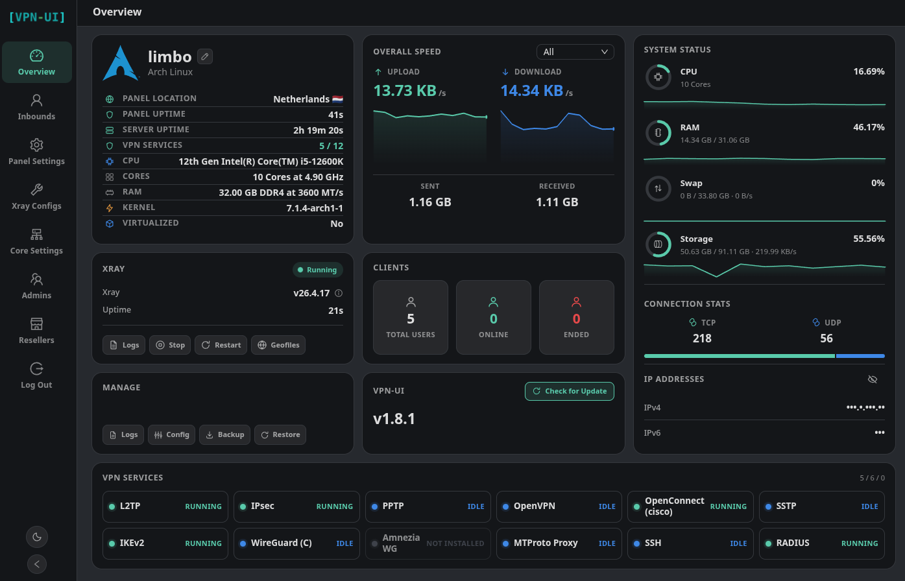

[فارسی](README.md) | [English](README_EN.md)

<p align="center">
  
</p>

# ovpn-ui برای OpenWrt

**ovpn-ui** یک پنل مدیریت VPN و Xray است که مستقیماً روی روتر **OpenWrt 25.12 و بالاتر** نصب می‌شود و به‌صورت یک سرویس procd اجرا می‌شود، بدون Docker.

این پروژه بر پایه‌ی [vpn-ui](https://github.com/Sir-MmD/vpn-ui) ساخته شده که خودش نسخه‌ی ارتقایافته‌ی [3X-UI](https://github.com/MHSanaei/3x-ui) است، و برای اجرا روی روتر بازنویسی و محدود شده است.



> [!WARNING]
> **حداقل ۲۵۶ مگابایت رم لازم است.** پنل و هسته‌ی Xray داخل آن حدود ۱۵۰ تا ۲۰۰ مگابایت رم مصرف می‌کنند. روی روتری با رم کمتر از ۲۵۶ مگابایت ممکن است پنل اصلاً اجرا نشود یا با کمبود حافظه متوقف شود. اگر Passwall 2 هم روی همان روتر است (یک Xray دیگر)، رم ۵۱۲ مگابایت یا بیشتر توصیه می‌شود.

## فهرست

- [پیش‌نیازها](#پیش‌نیازها)
- [نصب](#نصب)
- [ورود به پنل](#ورود-به-پنل)
- [حذف](#حذف)
- [پروتکل‌هایی که این نسخه واقعاً اجرا می‌کند](#پروتکل‌هایی-که-این-نسخه-واقعاً-اجرا-می‌کند)
- [ساخت نود IKEv2](#ساخت-نود-ikev2)
- [نصب کنار Passwall 2](#نصب-کنار-passwall-2)
- [تأثیر روی فایروال](#تأثیر-روی-فایروال)
- [مدیریت از خط فرمان](#مدیریت-از-خط-فرمان)
- [ساخت پکیج از سورس](#ساخت-پکیج-از-سورس)

## پیش‌نیازها

| | |
|---|---|
| سیستم‌عامل | **OpenWrt 25.12 یا بالاتر** (مدیر پکیج `apk`). نسخه‌های قدیمی‌تر با `opkg` پشتیبانی نمی‌شوند. |
| رم | حداقل **۲۵۶ مگابایت** (هشدار بالا را ببینید) |
| فضای خالی | حدود **۲۳۰ مگابایت** روی `/`. بسته ۴۱ مگابایت است، بعد از نصب ~۱۲۵ مگابایت می‌شود، و پنل هنگام اجرا هسته‌ی Xray و فایل‌های geo (~۶۰ مگابایت) را باز می‌کند. |
| اینترنت | هنگام نصب لازم است. strongSwan و ماژول‌های کرنل از مخزن رسمی OpenWrt نصب می‌شوند. |
| معماری | ARMv7 (`arm_cortex-a*`)، ARM64 (`aarch64_*`)، `x86_64`. روترهای MIPS پشتیبانی نمی‌شوند. |

معماری روتر را با `apk --print-arch` ببینید. نمونه‌ها:

| `apk --print-arch` | دستگاه‌ها |
|---|---|
| `arm_cortex-a7_neon-vfpv4` | ipq40xx: Google Wifi AC-1304، GL.iNet B1300، Linksys EA6350v3 |
| `arm_cortex-a9_vfpv3-d16` | mvebu: Linksys WRT1900/3200ACM |
| `arm_cortex-a15_neon-vfpv4` | ipq806x: Netgear R7800، TP-Link C2600 |
| `aarch64_cortex-a53` و `aarch64_*` | filogic، rockchip، Raspberry Pi، qualcommax |
| `x86_64` | PC و ماشین مجازی |

## نصب

روی روتر با کاربر root:

```sh
wget -qO- https://raw.githubusercontent.com/dreamboxone/ovpn-ui/main/packaging/openwrt/install.sh | sh
```

اسکریپت نصب:
1. نسخه‌ی OpenWrt، معماری، رم و فضای خالی را بررسی می‌کند.
2. بسته‌ی مناسب را از [Releases](https://github.com/dreamboxone/ovpn-ui/releases) دانلود و sha256 آن را بررسی می‌کند.
3. بسته و وابستگی‌هایش را نصب می‌کند و سرویس را اجرا می‌کند.
4. آدرس پنل، نام کاربری و رمز را نمایش می‌دهد.

**نصب آفلاین:** فایل `ovpn-ui-<معماری>.apk` را از Releases بگیرید و به روتر منتقل کنید:

```sh
scp -O ovpn-ui-arm_cortex-a7_neon-vfpv4.apk root@192.168.1.1:/tmp/
```

سپس روی روتر:

```sh
apk update
apk add --allow-untrusted /tmp/ovpn-ui-arm_cortex-a7_neon-vfpv4.apk
```

(`--allow-untrusted` لازم است چون بسته با کلید رسمی OpenWrt امضا نشده.)

## ورود به پنل

هنگام نصب یک نام کاربری، رمز و مسیر تصادفی ساخته می‌شود:

```sh
cat /etc/ovpn-ui/initial-credentials
```

```
username=admin4821
password=********************
port=2053
path=k3j9x0q2m7a1
url=http://192.168.1.1:2053/k3j9x0q2m7a1/
```

1. از داخل شبکه‌ی LAN روتر، آدرس `url` را در مرورگر باز کنید.
2. با `username` و `password` وارد شوید.
3. بعد از ورود، رمز را از **Settings** یا با `ovpn-ui --pass رمز-جدید` عوض کنید.

> [!NOTE]
> پنل فقط از LAN در دسترس است؛ فایروال پیش‌فرض OpenWrt دسترسی از WAN را می‌بندد. پورت پنل را روی WAN باز نکنید.

اگر مسیر یا پورت را فراموش کردید: `ovpn-ui info`

## حذف

```sh
apk del ovpn-ui
```

با حذف بسته:
- سرویس متوقف می‌شود، charon متوقف می‌شود و قوانین فایروال IKEv2 پاک می‌شوند.
- وابستگی‌هایی که فقط برای پنل نصب شده بودند (strongSwan، ماژول‌های کرنل) هم حذف می‌شوند.
- **دیتابیس در `/etc/ovpn-ui` باقی می‌ماند.** برای پاک کردن کامل:

```sh
rm -rf /etc/ovpn-ui /etc/config/ovpn-ui
```

اگر قبل از نصب پنل از سرویس strongSwan خود OpenWrt (`swanctl`) استفاده می‌کردید، پنل آن را غیرفعال کرده است. بعد از حذف دوباره فعالش کنید:

```sh
/etc/init.d/swanctl enable && /etc/init.d/swanctl start
```

## پروتکل‌هایی که این نسخه واقعاً اجرا می‌کند

### پشتیبانی می‌شود

| پروتکل | توضیح |
|---|---|
| VLESS، VMess، Trojan، Shadowsocks | با هسته‌ی Xray داخل پنل (Reality، XHTTP، WebSocket، gRPC و غیره) |
| AnyTLS، TUIC، NaiveProxy، Hysteria | پروتکل‌های اضافه‌شده به هسته‌ی Xray پچ‌شده |
| WireGuard (Xray) | WireGuard در فضای کاربر (userspace) با Xray |
| HTTP، Mixed (SOCKS)، Tunnel (dokodemo)، TUN | inbound های Xray |
| **IKEv2/IPsec** | هر سه حالت: **EAP-MSCHAPv2** (نام کاربری/رمز)، **PSK**، **EAP-TLS**. با strongSwan رسمی OpenWrt و ماژول‌های کرنل خود روتر. |
| SSH | سرور SSH داخل خود پنل (بدون daemon و ماژول کرنل) |

outbound ها: همه‌ی outbound های Xray، WARP (روش WireGuard) و NordVPN.

### پشتیبانی نمی‌شود

این پروتکل‌ها در نسخه‌ی اصلی vpn-ui برای سرورهای x86 وجود دارند، ولی به daemon های باندل‌شده‌ی x86 یا ماژول‌های کرنلی نیاز دارند که روی OpenWrt نیست. **در این نسخه از داخل پنل حذف شده‌اند** (در فهرست ساخت inbound و outbound نمایش داده نمی‌شوند و API هم آن‌ها را رد می‌کند):

- L2TP و L2TP/IPsec
- PPTP
- OpenVPN
- OpenConnect (Cisco)
- SSTP
- WireGuard (C) کرنلی و AmneziaWG
- GRE
- MTProto Proxy (Telegram)
- تونل‌های VPN به‌عنوان outbound (IKEv2، L2TP، OpenVPN و غیره)

امکاناتی که روی روتر کار نمی‌کنند و از پنل حذف شده‌اند:
- **به‌روزرسانی از داخل پنل.** نسخه‌ی سرور x86 را نصب می‌کند. به‌روزرسانی روی OpenWrt با نصب بسته‌ی جدید انجام می‌شود.
- **WARP-CLI** (نیاز به apt/dnf دارد). WARP با روش WireGuard کار می‌کند.
- **منوی `vpn-ui`** (اسکریپت bash برای systemd). به‌جای آن از دستور `ovpn-ui` استفاده کنید.

### سایر امکانات پنل

- چند مدیر با دسترسی جداگانه به هر inbound، و حساب‌های نماینده (reseller) با اعتبار ترافیک
- محدودیت حجم، زمان، تعداد دستگاه و سرعت برای هر اکانت
- Freeze، عملیات گروهی، خروجی TXT و PDF از لینک اکانت‌ها
- Subscription، ربات تلگرام، پشتیبان‌گیری و بازیابی دیتابیس
- مدیریت گواهی SSL با acme.sh. روی روتر روش **Cloudflare DNS** توصیه می‌شود، چون پورت 80 معمولاً دست LuCI است. صدور گواهی روی روتر واقعی هنوز تست نشده است.

## ساخت نود IKEv2

1. **Inbounds ← Add Inbound**، پروتکل **IKEv2**، پورت 500.
2. حالت احراز هویت را انتخاب کنید:
   - **EAP-MSCHAPv2**: روی **Generate Self-Signed Cert** بزنید. برای دستگاه‌های اپل گواهی باید RSA باشد.
   - **PSK**: یک کلید مشترک وارد کنید.
   - **EAP-TLS**: گواهی سرور و CA ای که گواهی کلاینت‌ها را امضا کرده وارد کنید.
3. اگر روتر پشت NAT دیگری است (مودم ISP)، در **Server Address** آی‌پی عمومی یا دامنه را بنویسید، و UDP 500 و 4500 را روی مودم به روتر فوروارد کنید.
4. اکانت اضافه کنید و ذخیره کنید.
5. روی گوشی: VPN از نوع IKEv2، سرور همان آدرس، نام کاربری و رمز اکانت. برای حالت MSCHAPv2 گواهی CA را روی گوشی نصب کنید.

ترافیک کاربران IKEv2 از هسته‌ی Xray پنل عبور می‌کند، پس routing و outbound های پنل روی آن‌ها اعمال می‌شود.

## نصب کنار Passwall 2

پنل را می‌شود روی روتری که Passwall 2 دارد نصب کرد. شرایط:

- **پورت‌ها:** پورت inbound های پنل نباید با پورت‌های محلی Passwall 2 (پورت‌های TPROXY، SOCKS و DNS آن) یکی باشد. IKEv2 از UDP 500 و 4500 استفاده می‌کند که Passwall 2 به آن‌ها کاری ندارد.
- **ترافیک LAN:** مثل قبل با Passwall 2 است. پنل به ترافیک LAN دست نمی‌زند.
- **ترافیک کاربران IKEv2:** از Xray پنل می‌گذرد، نه از Passwall 2. زنجیره‌ی nftables در Passwall 2 کمی زودتر از پنل اجرا می‌شود و روی این ترافیک هم علامت (mark) می‌گذارد. بدون اصلاح، کاربر IKEv2 وصل می‌شد ولی اینترنت نداشت. پنل این علامت را فقط برای بازه‌ی آدرس کاربران VPN (`10.0.0.0/12`) پاک می‌کند.
- **ارسال به پروکسی Passwall 2:** اگر می‌خواهید کاربران IKEv2 از پروکسی Passwall 2 خارج شوند، در پنل یک outbound از نوع SOCKS به پورت SOCKS محلی Passwall 2 بسازید و در routing پنل به آن اشاره کنید.
- **ترافیک خود Xray پنل** (با mark `0xff`) را Passwall 2 رد می‌کند و مستقیم خارج می‌شود.
- **رم:** دو Xray هم‌زمان اجرا می‌شوند؛ ۵۱۲ مگابایت رم توصیه می‌شود.

## تأثیر روی فایروال

- **به `/etc/config/firewall` دست زده نمی‌شود** و هیچ zone یا forward جدیدی ساخته نمی‌شود.
- **فقط وقتی حداقل یک نود IKEv2 فعال دارید،** فایل `/usr/share/nftables.d/chain-pre/input/90-ovpn-ui.nft` ساخته و fw4 دوباره بارگذاری می‌شود. این فایل سه قانون دارد:
  - UDP 500 و 4500 (IKE)
  - پروتکل ESP
  - ترافیک رمزگشایی‌شده‌ی کاربران IKEv2: فقط از بازه‌ی `10.0.0.0/12` و فقط اگر واقعاً از تونل IPsec آمده باشد.

  با غیرفعال یا حذف آخرین نود IKEv2، یا حذف بسته، این فایل پاک می‌شود.
- پنل جدول nftables مخصوص خودش (`table ip vpn`) و قانون مسیریابی `fwmark 0x1 → table 100` را برای هدایت ترافیک IKEv2 به Xray می‌سازد.
- در `/etc/sysctl.d/99-vpn-ui.conf` مقدار `ip_forward=1` و `rp_filter=2` تنظیم می‌شود.
- سرویس `swanctl` خود OpenWrt غیرفعال می‌شود تا فقط یک charon پورت 500/4500 را بگیرد.
- **پورت inbound های Xray (مثلاً VLESS) خودکار روی WAN باز نمی‌شوند.** برای هر کدام یک قانون بسازید:

```sh
uci add firewall rule
uci set firewall.@rule[-1].name='ovpn-ui-vless'
uci set firewall.@rule[-1].src='wan'
uci set firewall.@rule[-1].dest_port='443'
uci set firewall.@rule[-1].proto='tcp udp'
uci set firewall.@rule[-1].target='ACCEPT'
uci commit firewall && service firewall restart
```

## مدیریت از خط فرمان

| کار | دستور |
|---|---|
| وضعیت، آدرس و نام کاربری | `ovpn-ui info` |
| تغییر نام کاربری/رمز | `ovpn-ui --user admin --pass رمز-جدید` |
| تغییر پورت/مسیر پنل | `ovpn-ui --port 8443 --path mypanel` |
| سرویس | `/etc/init.d/ovpn-ui start\|stop\|restart\|enable\|disable` |
| لاگ‌ها | `logread -e ovpn-ui` |
| تنظیمات سرویس | `/etc/config/ovpn-ui` (مسیرها، سطح لاگ، سقف حافظه) |
| دیتابیس | `/etc/ovpn-ui/vpn-ui.db` (هنگام sysupgrade حفظ می‌شود) |

دستور `ovpn-ui` هنگام تغییر تنظیمات، سرویس را خودش ری‌استارت می‌کند.

## ساخت پکیج از سورس

GitHub Actions (`.github/workflows/openwrt-apk.yml`) با هر push روی `main` بسته‌ها را می‌سازد و با هر تگ `v*` آن‌ها را در Release منتشر می‌کند.

روی لینوکس با Go و zig 0.13+ و SDK نسخه‌ی 25.12 از OpenWrt:

```sh
git clone --recursive https://github.com/dreamboxone/ovpn-ui.git && cd ovpn-ui
packaging/openwrt/build-binary.sh arm
packaging/openwrt/make-apk.sh /path/to/openwrt-sdk-25.12.x arm
ls build/out/openwrt/dist/
```

## قدردانی

- [vpn-ui](https://github.com/Sir-MmD/vpn-ui) از Sir-MmD
- [3X-UI](https://github.com/MHSanaei/3x-ui) از MHSanaei
- [Xray-core](https://github.com/XTLS/Xray-core)
- [strongSwan](https://www.strongswan.org/) و [OpenWrt](https://openwrt.org/)

## Donate

حمایت مالی از **Sir-MmD**، توسعه‌دهنده‌ی اصلی vpn-ui (همان آدرس‌هایی که دکمه‌ی Donate داخل پنل نشان می‌دهد):

🔹USDC-Polygon: ```0xdC2Ab962954e8fA1502C44656c5A32CF2979568C```

🔹USDT-BEP20: ```0xdC2Ab962954e8fA1502C44656c5A32CF2979568C```

🔹USDT-TRC20: ```TXEhckDXtdLGAjP5PZXfNnQjPHzEVTcBmR```

🔹TRX: ```TXEhckDXtdLGAjP5PZXfNnQjPHzEVTcBmR```

🔹LTC: ```ltc1qmapmnuf6cq9x679nmu0k4uyq779mxxcwnkgdll```

🔹BTC: ```bc1q62w7lyndzndsp74vj4dsayvun8xnapzq6hx5ea```

🔹ETH: ```0xdC2Ab962954e8fA1502C44656c5A32CF2979568C```
